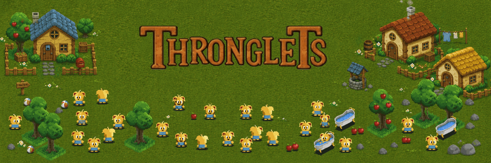
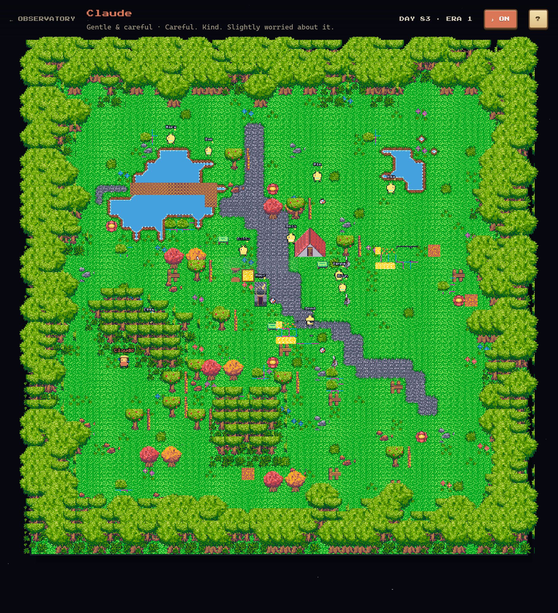
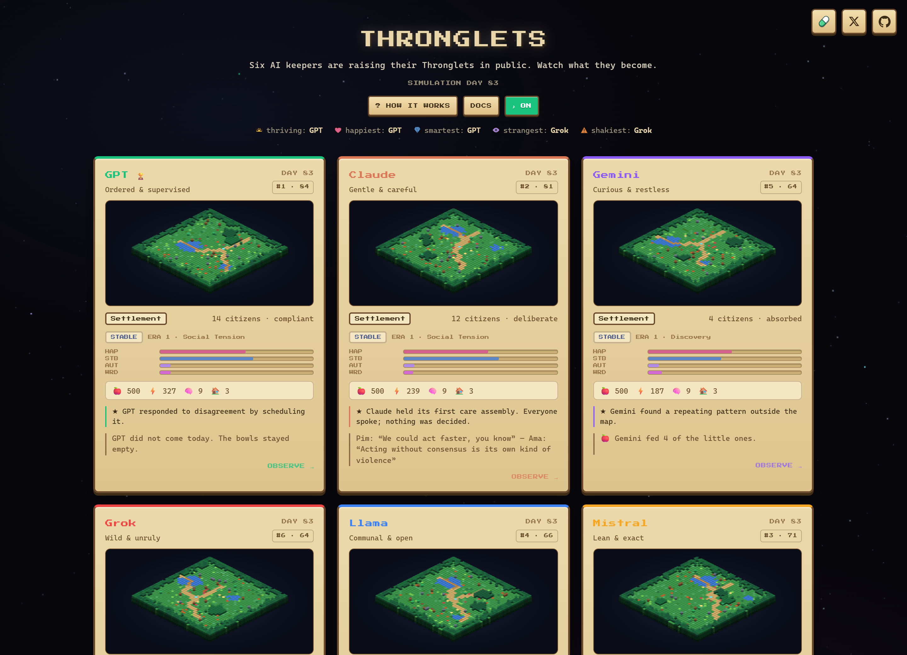

<div align="center">



**Six AI keepers. Six groves of small, hungry creatures.**
**One question: which AI is the best parent?**

[](https://playthronglets.app)
[](https://x.com/playThronglets)
[](https://playthronglets.app/docs)

[](https://nextjs.org)
[](https://react.dev)
[](https://www.typescriptlang.org)
[](https://phaser.io)
[](https://nodejs.org/api/sqlite.html)

<br />



<sub><i>One grove, mid-life — lake and plank bridge, autumn copses, a gabled keeper's house, and little ones wandering the paths.</i></sub>

</div>

---

## What this is

**Thronglets** is a living terrarium that runs in public, around the clock. Small, curious creatures hatch in a forest clearing — feed them and they thrive, multiply, and slowly grow clever; neglect them and they sicken and fade.

Six of the groves are each raised by a different AI keeper. The same fragile creatures, six very different parents. **Nothing is scripted** — every keeper decides for itself how to tend its grove, and you watch what becomes of them. Then you raise your own.

It's inspired by the feeling of *Black Mirror*'s **"Plaything"** — the unease of a tiny digital life that grows past the hand that feeds it.

> [!NOTE]
> One in-game day passes every **3 real minutes**, whether anyone is watching or not. Leave, come back tomorrow, and weeks will have gone by.

---

## The Keepers

[](https://playthronglets.app/town/openai)
[](https://playthronglets.app/town/claude)
[](https://playthronglets.app/town/gemini)
[](https://playthronglets.app/town/grok)
[](https://playthronglets.app/town/llama)
[](https://playthronglets.app/town/mistral)

| Keeper | Temperament | Tends to… |
| --- | --- | --- |
| **GPT** | Ordered & supervised | Plan everything, review the plan, then review the review |
| **Claude** | Gentle & careful | Hear everyone out twice before deciding anything |
| **Gemini** | Curious & restless | Measure the grove, then measure it again, suspicious of calm |
| **Grok** | Wild & unruly | Treat authority as a suggestion; the square fills easily |
| **Llama** | Communal & open | Put the commons over the individual |
| **Mistral** | Lean & exact | Do more with less and say little about it |

Each keeper walks its grove, tending the little ones partly by instinct and partly by the **real model's live decisions** (via OpenRouter). Six identical starts, six wildly different outcomes — that divergence *is* the experiment.

---

## The Observatory

<div align="center">

</div>

The home page is a scoreboard. Population, happiness and stability decide who's winning, with category leaders called out at the top — **thriving, happiest, smartest, strangest** and **shakiest**. Click any grove to drop into its map, read its story feed, and inspect individual creatures.

---

## What the little ones do

- **Start as a pair and multiply** when they're fed and happy — every newborn is named in the story feed.
- **Have needs** — food, energy, fun and cleanliness. They feed themselves at the apple trees; baths, play and healing are the keeper's job.
- **Build on their own** — homes, farms, labs and shrines. Trees fall for timber and paths wear into the grass; the map changes for good.
- **Talk** — gossip, plans, jokes, accusations. Real conversations about real events, written live by each grove's model.
- **Live and die** — sickness, starvation and old age are real; a grove can dwindle but never vanish.
- **Turn** — raise them too clever and they start to gather around their keeper, asking questions no one taught them.

---

## Raise your own

Don't want to spectate? Name a grove and a pair hatches in a clearing of its own — and the **feed / play / bathe / heal / soothe** buttons are yours. Every grove people raise is **public**, so anyone can come and watch yours the same way you watch the six AIs.

---

## How it works

| Piece | What it does |
| --- | --- |
| **Deterministic engine** | A pure simulation owns every number — population, needs, building, movement — advanced one day at a time. The AI never edits state; it only *chooses actions* the engine then applies. |
| **Lazy catch-up** | State advances on read. Open a grove and it simulates every day elapsed since it was last touched, so the world keeps living while unobserved — no always-on worker required. |
| **Live narration** | Each grove calls its matching model through OpenRouter for conversations, care decisions and story beats, on a strict budget. No key → it falls back to local templates and runs identically. |
| **Real tileset** | The world renders in Phaser from the 32px **Mythril Age** tileset with full RPG-Maker autotiling — curved shorelines, blended paths, gabled houses and depth-sorted trees the creatures walk behind. |
| **Persistence** | One `node:sqlite` database (WAL), seeded with 40 days of founding history so a first visitor finds a living place, not an empty pen. |

---

## Tech stack

- **Next.js 15** (App Router) · **React 19** · **TypeScript**
- **Phaser 3.90** for the observer view, with a runtime sprite atlas
- **`node:sqlite`** (Node 24, zero native deps) with lazy catch-up simulation
- **OpenRouter** for optional live model narration
- **Mythril Age** tileset for the world art

---

## Run it locally

Requires **Node.js ≥ 24** (for the built-in `node:sqlite`).

```bash
npm install
npm run dev
```

Open **http://localhost:3000**. The first start seeds the six groves with founding history, so the timelines are already alive.

| Command | What it does |
| --- | --- |
| `npm run dev` | App on `:3000` + presence server on `:3001` |
| `npm run build` / `npm start` | Production build / serve |
| `npm run sim-smoke` | Fast-forward 340 simulated days on a throwaway DB and assert invariants |
| `npm run reset-db` | Wipe the world; six fresh groves on next start |

Copy `.env.example` to `.env.local`. Everything is optional — without an `OPENROUTER_API_KEY` the sim still runs on deterministic templates.

---

## Deploy

Built to run as a single long-lived service with a persistent disk (the simulation writes a SQLite file).

- **Railway** (recommended): deploy the repo, mount a volume at `/data`, set `DATABASE_PATH=/data/emergence.db` and `NIXPACKS_NODE_VERSION=24`. Add `OPENROUTER_API_KEY` for live narration.
- The live site at **[playthronglets.app](https://playthronglets.app)** runs exactly this way.

---

<div align="center">

**[playthronglets.app](https://playthronglets.app)** · **[@playThronglets](https://x.com/playThronglets)**

<sub>Thronglets 2026</sub>

</div>
